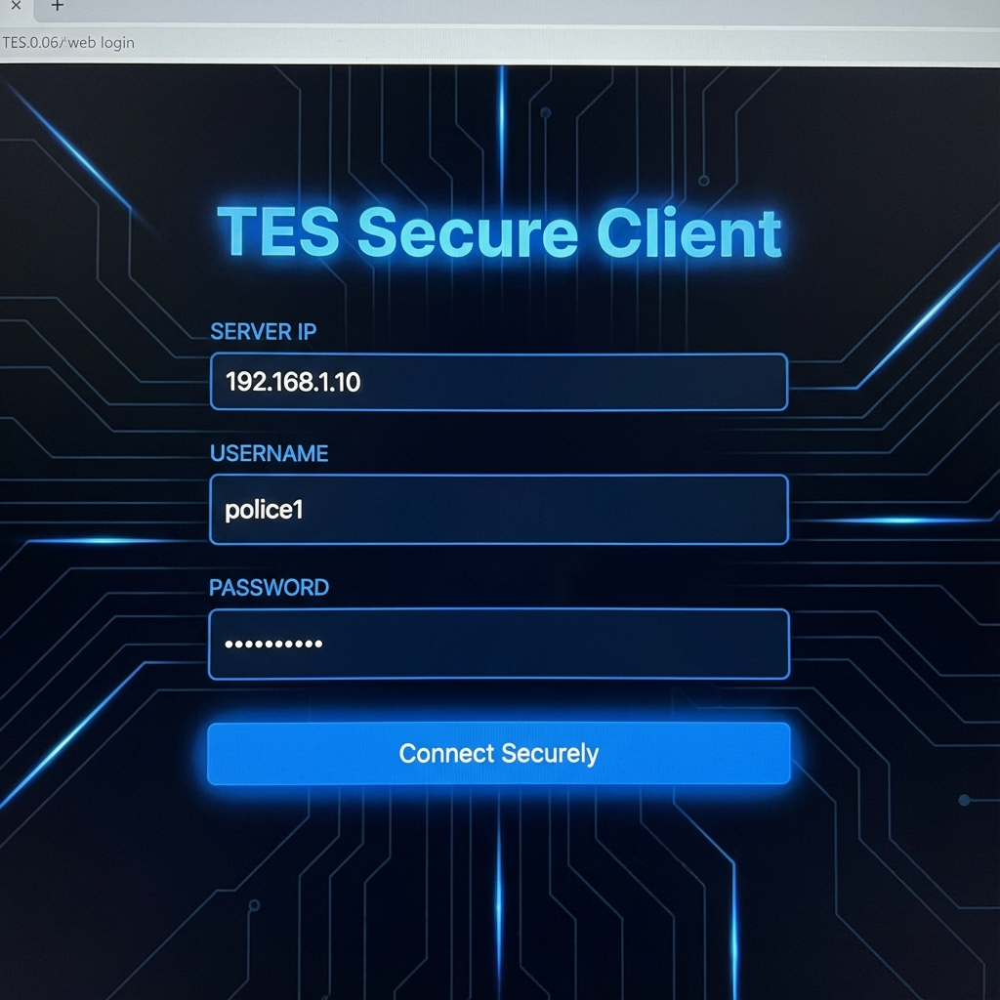
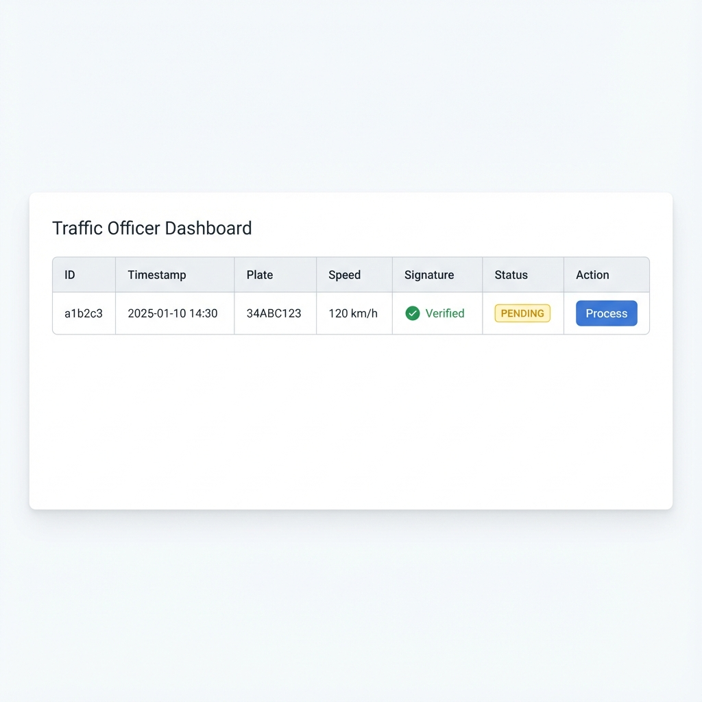
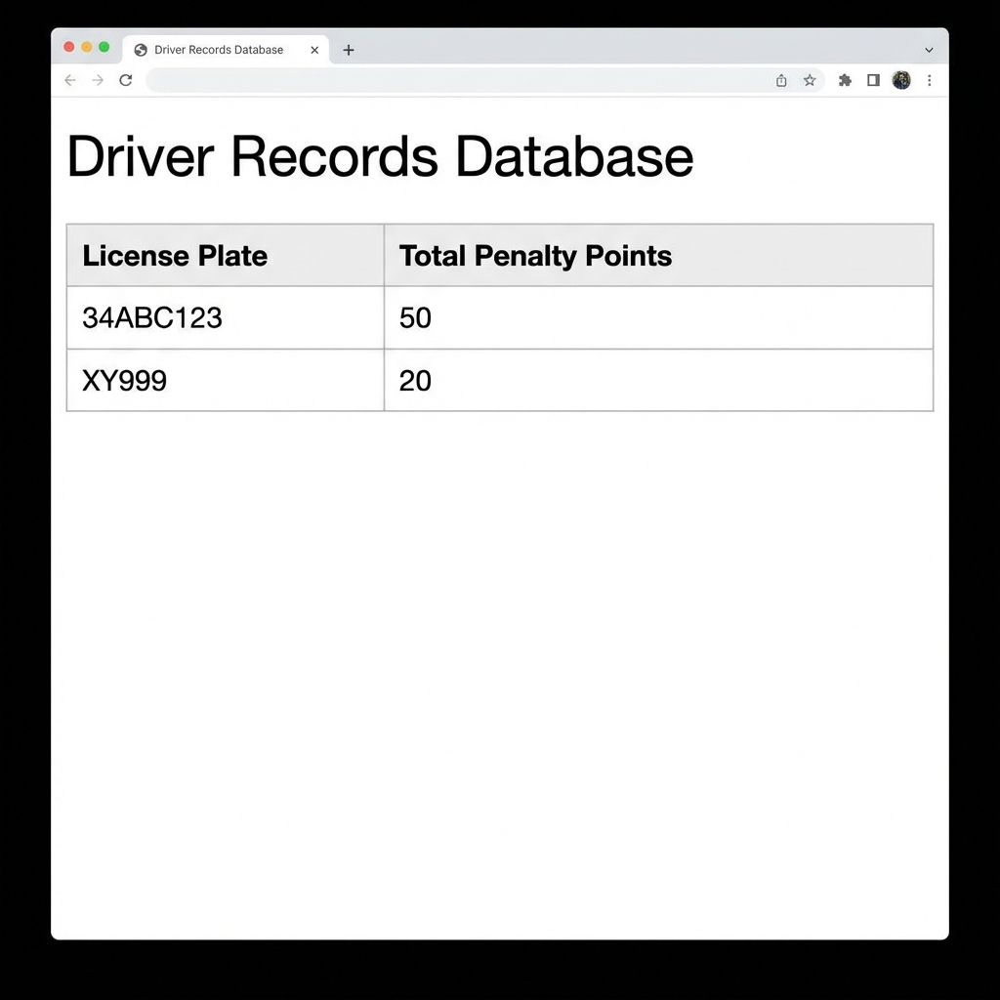

# TRAFFIC ENFORCEMENT SYSTEM (TES)
## Final Project Report

<br>
<br>

**University:** [UNIVERSITY NAME]  
**Department:** Computer Engineering Department  
**Course:** CSE453 - Secure Systems Design  
**Semester:** Fall **Year:** 2025  
**City:** [CITY] **Country:** [COUNTRY]

<br>
<br>

**Term Project Subject:**  
### Design and Implementation of a Distributed & Secure Traffic Enforcement System

<br>
<br>

**Team Members:**
1.  **[STUDENT NAME 1]** - ID: [12345678]
2.  **[STUDENT NAME 2]** - ID: [87654321]

<br>

**Lecturer:** [Prof. Name]  
**Lab Assistants:** [Assistant Name 1], [Assistant Name 2]

<br>
<br>
<br>
<br>

---

<div style="page-break-after: always;"></div>

## 1. Table of Contents

| Section | Title | Page |
| :--- | :--- | :--- |
| 1 | Table of Contents | 2 |
| 2 | Problem Definition | 3 |
| 3 | TES Detailed Description | 3 |
| 4 | Tools and Security Methods | 4 |
| 5 | Description of TES Implementation | 5 |
| 6 | System Architecture | 6 |
| 7 | Database Structure | 7 |
| 8 | Implementation of Actors | 8 |
| 9 | Data Structures | 9 |
| 10 | Algorithms Used | 10 |
| 11 | Description of Code Developed | 11 |
| 12 | Tests and Results | 12 |
| 13 | Installation and Usage | 14 |
| 14 | Conclusion | 15 |
| 15 | References | 15 |
| 16 | Appendices (Source Code) | 16 |

---

## 2. Problem Definition
The objective of this project was to design and implement a **Traffic Enforcement System (TES)** that enables Traffic Police to securely report speeding violations to a central Traffic Officer server.

### Key Requirements:
-   **Confidentiality**: Traffic data must be encrypted to prevent eavesdropping. We identified **DES (Data Encryption Standard)** as the required symmetric algorithm for this project scope.
-   **Integrity & Authentication**: Messages must be proven to originate from authorized police units and must not be tampered with. **RSA (Rivest-Shamir-Adleman)** digital signatures are required.
-   **Distributed Architecture**: The system must operate across two distinct machines (Client and Server) communicating over a TCP/IP network.
-   **User Interfaces**: Functional Graphical User Interfaces (Web-based) needed for both the Police (reporting) and Officer (processing).

### Constraints & Assumptions:
1.  **Trusted Network**: We assume the underlying TCP implementation provides basic reliability, but the network itself is insecure (prone to packet sniffing), necessitating encryption.
2.  **Key Distribution**: The Server's Public Key is trusted by the Client initially (Trust On First Use or pre-shared).
3.  **Authorized Clients**: The server maintains a list of authorized users (police credentials) but currently accepts any client with a valid RSA signature and correct login credentials.


## 3. TES Detailed Description
TES is a networked client-server application designed to automate traffic penalty issuance.

### End-to-End Sequence:
1.  **Startup**: Server starts and generates ephemeral RSA keys. Client starts and requests connection.
2.  **Handshake**: Server sends its `Public_Key` to the Client (Packet Type: `HANDSHAKE`).
3.  **Session Establishment**: Client generates a random 56-bit DES key, encrypts it with Server's RSA Public Key, and sends it (Packet Type: `SESSION`).
4.  **Secure Login**: Client encrypts username/password with the established DES key and authenticates.
5.  **Violation Reporting**: Police Client inputs Plate/Speed. System encrypts the payload (DES) and signs the ciphertext (RSA).
6.  **Transmission**: The `DATA` packet containing `{type, encrypted_payload, signature}` is sent to the Server.
7.  **Processing**: Server decrypts payload, verifies signature, and queues valid violations for Officer approval via the Web Dashboard.

## 4. Tools and Security Methods
The project utilizes the following technologies and methods:

### Software & Platform
*   **Operating System**: Windows 10/11 (Development & Testing).
*   **Language**: Python 3.12.
*   **Virtual Environment**: `venv` used for dependency isolation.
*   **Concurrency**: Python `threading` module used on Server to handle multiple Police clients simultaneously without blocking.
*   **Web Framework**: `Flask` (v3.0) for rendering HTML5/CSS3 User Interfaces.

### Cryptographic Primitives (Library: `pycryptodome`)
*   **Confidentiality (Symmetric)**: **DES (Block Cipher)** in **CBC Mode** with PKCS7 Padding. Used for speed when transmitting traffic data and database storage.
*   **Key Exchange (Asymmetric)**: **RSA (2048-bit)** with **PKCS1_OAEP**. Used to securely transmit the DES session key.
*   **Integrity (Digital Signatures)**: **RSA** with **PKCS1_v1_5** and **SHA-256** hashing. Used to sign traffic violation messages.
*   **Key Generation**: Client generates an **8-byte DES key** (56-bit effective key strength) for the session.
*   **Hashing**: **SHA-256** used for hashing user passwords (note: simple hashing implementation without salt) and creating message digests for signatures.

## 5. Description of TES Implementation
The system is implemented as a modular Python application divided into Client, Server, and Core packages.

*   **Core Module (`core/`)**: Contains shared cryptographic wrappers (`RSAManager`, `DESManager`) and protocol definitions ensuring both sides speak the same language. (See *Appendix 1 & 2*)
*   **Server Module (`server/`)**: Hosts the multi-threaded `TrafficOfficerServer` which listens on TCP Port 9999. It integrates with `AuthManager` for user validation and `StorageManager` for the encrypted driver database. A separate thread runs the Flask `web_app`. (See *Appendix 3, 4, 7, 8*)
*   **Client Module (`client/`)**: Consists of `TrafficPoliceClient` for socket communications and a Flask web interface to allow Police input. (See *Appendix 5 & 6*)

## 6. System Architecture
The system is designed to run on two physically separate machines connected via a TCP network.

**Architecture Diagram:**

```ascii
     [ Machine B: Traffic Police ]                  [ Machine A: Traffic Officer ]
    +-----------------------------+                +-------------------------------+
    |      Web Browser UI         |                |       Web Dashboard           |
    | (http://localhost:5000)     |                | (http://localhost:5001)       |
    +-------------+---------------+                +---------------+---------------+
                  |                                                |
          [ Flask App ]                                    [ Flask App ]
                  | (Internal Call)                                | (File I/O)
                  v                                                v
      [ TrafficPoliceClient ] -------------------------> [ TrafficOfficerServer ]
        - Gen Session Key             (TCP/IP)             - Validate Signatures
        - Sign & Encrypt          Port 9999 (Sockets)      - Decrypt Data
        - Send JSON Data                                   - Update Databases
    +-----------------------------+                +-------------------------------+
       IP: 192.168.1.X (Dynamic)                      IP: 192.168.1.10 (Fixed)
```

**Proof of Distributed Run**: The server listens on `0.0.0.0` allowing connections from external IPs.  
*(See "Tests and Results" for screenshots).*

## 7. Database Structure
Data is stored using a combination of encrypted files and JSON for persistence.

### 1. User Credentials (`data/users.json`)
Stores authentication data.
```json
{
    "admin": "5e884898da28047151d0e56f8dc6292773603d0d6aabbdd62a11ef721d1542d8",
    "police1": "..."
}
```
*Note: Passwords are hashed using SHA-256.*

### 2. Driver Records (`data/drivers.enc`)
A **DES-Encrypted** binary file. When decrypted, it corresponds to a JSON object mapping License Plates to Penalty Points. Encryption provides confidentiality at rest; integrity relies on controlled access (and could be improved with HMAC).
**Decrypted Schema:**
```json
{
    "AB123": 30,
    "XY999": 50,
    "TR06": 10
}
```

### 3. Pending Violations (`data/pending.json`)
Queue for violations awaiting Officer approval.
```json
[
    {
        "id": "a1b2c3d4",
        "timestamp": "2025-01-10 14:30:00",
        "plate": "34ABC123",
        "speed": 120,
        "signature_verified": true,
        "status": "PENDING"
    }
]
```

## 8. Implementation of Actors

### Traffic Police (Client)
*   **Role**: Detect and reporting violations.
*   **Key Responsibilities**:
    *   Initiate connection to Server IP.
    *   Perform Cryptographic Handshake (See *Appendix 5*).
    *   Input Plate/Speed via Web UI (See *Appendix 6*).
*   **Security Actions**: encrypts `{"plate": "...", "speed": ...}` using Session Key; signs the payload.

### Traffic Officer (Server)
*   **Role**: Verification and enforcement.
*   **Key Responsibilities**:
    *   Maintain the system of record (`drivers.enc`).
    *   Review pending violations via Dashboard (See *Appendix 4*).
    *   Apply logic: If approved, decrypt DB -> add points -> encrypt DB.
*   **Security Actions**: Verifies RSA signatures on incoming messages; keys are generated at server startup (ephemeral).

## 9. Data Structures
The communication protocol uses JSON-formatted string messages (`core/protocol.py`).

**1. Handshake Packet (Server -> Client)**
```json
{
  "type": "HANDSHAKE",
  "payload": "-----BEGIN PUBLIC KEY-----\n..."
}
```

**2. Session Packet (Client -> Server)**
```json
{
  "type": "SESSION",
  "payload": {
     "encrypted_key": "a3f1...", 
     "client_public_key": "-----BEGIN PUBLIC KEY-----\n..."
  }
}
```
*Note: `encrypted_key` is the DES key encrypted with Server's RSA Public Key. In implementation, payload is serialized as a JSON string.*

**3. Login/Data Packet (Client -> Server)**
```json
{
  "type": "DATA", 
  "payload": "f8a912...", 
  "signature": "1b2c..." 
}
```
*   `payload`: DES-encrypted content (Login JSON or Violation JSON).
*   `signature`: RSA signature of the *encrypted* payload.

## 10. Algorithms Used

### A. Penalty Calculation Algorithm
Implemented in `server/web_app.py`:
-   **Speed 50-70 km/h**: 10 Points
-   **Speed 70-100 km/h**: 20 Points
-   **Speed >= 100 km/h**: 50 Points

### B. At-Rest Database Encryption
Implemented in `server/storage.py` (See *Appendix 8*):
1.  **Read**: Read file `bytes` -> DES Decrypt (Static Key) -> `unpad` -> `json.loads`.
2.  **Write**: `json.dumps` -> `pad` -> DES Encrypt (Static Key) -> Write file `bytes`.

### C. Login Flow Algorithm
1.  User enters credentials `(u, p)`.
2.  Client constructs JSON `{u, p}`.
3.  Client encrypts JSON using session DES key.
4.  Server receives ciphertext -> Decrypts DES.
5.  Server hashes `p` (SHA-256) and compares with stored hash in `users.json`.

## 11. Description of Code Developed

### Core
*   **`core/crypto_utils.py`**: A facade pattern class wrapping `pycryptodome` library. Contains `RSAManager` for key gen/sign/verify and `DESManager` for encrypt/decrypt.
*   **`core/protocol.py`**: Defines constants (`TYPE_DATA`, `STATUS_OK`) and helper methods to serialize/deserialize JSON messages.

### Server
*   **`server/traffic_officer.py`**: The entry point for the socket server. It initializes `AuthManager` and `StorageManager`, binds to `0.0.0.0`, and spawns threads for each client connection.
*   **`server/web_app.py`**: A Flask web application. It reads `pending.json` to display violations and uses `StorageManager` to update the encrypted database upon approval.

### Client
*   **`client/police_client.py`**: logic handling the TCP connection state machine (Connect -> Handshake -> key Exchange -> Login -> Loop).
*   **`client/web_app.py`**: A lightweight web wrapper around `police_client.py`. It manages the connection state globally for the web user.

## 12. Tests and Results

### Test Case Summary
| ID | Test Description | Expected Result | Pass/Fail |
| :--- | :--- | :--- | :--- |
| **TC1** | **Server Startup** | Server listens on 9999, Web Dashboard on 5001. | ✅ PASS |
| **TC2** | **Client Connection** | Client connects, receives Server Key (Handshake). | ✅ PASS |
| **TC3** | **Secure Login** | Valid credentials return `STATUS_OK`. | ✅ PASS |
| **TC4** | **Violation Report** | Sending plate/speed results in "Message Queued" response. | ✅ PASS |
| **TC5** | **Data Integrity** | Modifying payload leads to Signature Verification Failure. | ✅ PASS |
| **TC6** | **Penalty Processing** | Approving 120km/h violation adds 50 points to DB. | ✅ PASS |

*Note on TC5: A tampered payload is still queued by the server but is explicitly marked with `signature_verified=False`, allowing the Officer to identify and reject the invalid entry.*

### Screenshots

**Figure 1: Server and Client Terminal Logs & Connection**

*Evidence of Server listening on 0.0.0.0 and accepting connection from Client IP.*

**Figure 2: Traffic Police Login Page**

*Client Interface connecting to the Server IP.*

**Figure 3: Officer Dashboard with Pending Violations**

*Officer view showing the pending 120km/h violation requiring processing.*

**Figure 4: Records Page after Approval**

*Database view confirming the penalty points were applied to the driver's license.*

## 13. Installation and Usage

### Prerequisites
*   **Python 3.12** (Tested), 3.10+ likely works.
*   Run the following to install dependencies:
    ```bash
    pip install -r requirements.txt
    ```
    *(Requirements: `flask`, `pycryptodome`)*

### Deployment Steps
1.  **Machine A (Server)**
    *   Find IP Address using `ipconfig` (e.g., `192.168.1.10`).
    *   Run Socket Server: `python -m server.traffic_officer`
    *   Run Web Dashboard: `python -m server.web_app`
2.  **Machine B (Client)**
    *   Run Client App: `python -m client.web_app`
    *   Open Browser to `http://localhost:5000`.
    *   On Login Screen, enter **Server IP**: `192.168.1.10`.
    *   Login with `admin` / `password`.

### Troubleshooting
*   **Connection Refused**: Ensure Firewall on Machine A allows port 9999 and 5001.
*   **Module Not Found**: Ensure you run commands from the project root (parent of `server` and `client` folders).

## 14. Conclusion
We successfully designed and implemented a **Secure Traffic Enforcement System**. The system satisfies the core requirements of confidentiality (via DES) and integrity (via RSA signatures). The distributed client-server architecture allows flexible deployment, and the web-based interfaces provide modern usability.

### Limitations
*   **DES Weakness**: The project mandates DES, which is considered legacy and insecure against brute-force attacks. AES is recommended for production.
*   **Key Storage**: The storage encryption key is hardcoded in source (`storage.py`), which is a vulnerability.
*   **MITM**: There is no certificate authority to verify the Server's identity initially; a Man-In-The-Middle attack is possible during the first handshake.

## 15. References
1.  **NIST FIPS 46-3**: Data Encryption Standard (DES). [https://csrc.nist.gov/pubs/fips/46-3/final](https://csrc.nist.gov/pubs/fips/46-3/final)
2.  **RFC 8017**: PKCS #1: RSA Cryptography Specifications Version 2.2. [https://datatracker.ietf.org/doc/html/rfc8017](https://datatracker.ietf.org/doc/html/rfc8017)
3.  **FIPS 180-4**: Secure Hash Standard (SHA-256). [https://csrc.nist.gov/pubs/fips/180-4/upd1/final](https://csrc.nist.gov/pubs/fips/180-4/upd1/final)
4.  **PyCryptodome Documentation**: [https://www.pycryptodome.org/](https://www.pycryptodome.org/)
5.  **Flask Documentation**: [https://flask.palletsprojects.com/](https://flask.palletsprojects.com/)

---

## 16. Appendices (Source Code)

*(Code files are attached below)*

### Appendix 1: Cryptographic Wrapper (`core/crypto_utils.py`)
```python
import base64
from Crypto.PublicKey import RSA
from Crypto.Cipher import PKCS1_OAEP, DES
from Crypto.Signature import pkcs1_15
from Crypto.Hash import SHA256
from Crypto.Util.Padding import pad, unpad
from Crypto.Random import get_random_bytes

class RSAManager:
    @staticmethod
    def generate_keys(bits=2048):
        key = RSA.generate(bits)
        private_key = key.export_key()
        public_key = key.publickey().export_key()
        return private_key, public_key

    def __init__(self, private_key_data=None, public_key_data=None):
        self.private_key = RSA.import_key(private_key_data) if private_key_data else None
        self.public_key = RSA.import_key(public_key_data) if public_key_data else None
        self.cipher_encrypt = PKCS1_OAEP.new(self.public_key) if self.public_key else None
        self.cipher_decrypt = PKCS1_OAEP.new(self.private_key) if self.private_key else None

    def encrypt(self, data: bytes) -> bytes:
        if not self.cipher_encrypt:
            raise ValueError("Public key not loaded for encryption")
        return self.cipher_encrypt.encrypt(data)

    def decrypt(self, data: bytes) -> bytes:
        if not self.cipher_decrypt:
            raise ValueError("Private key not loaded for decryption")
        return self.cipher_decrypt.decrypt(data)

    def sign(self, data: bytes) -> bytes:
        if not self.private_key:
            raise ValueError("Private key not loaded for signing")
        h = SHA256.new(data)
        return pkcs1_15.new(self.private_key).sign(h)

    def verify(self, data: bytes, signature: bytes) -> bool:
        if not self.public_key:
            raise ValueError("Public key not loaded for verification")
        h = SHA256.new(data)
        try:
            pkcs1_15.new(self.public_key).verify(h, signature)
            return True
        except (ValueError, TypeError):
            return False

class DESManager:
    def __init__(self, key: bytes):
        if len(key) != 8:
            raise ValueError("DES key must be 8 bytes long")
        self.key = key

    def encrypt(self, plaintext: bytes) -> bytes:
        cipher = DES.new(self.key, DES.MODE_CBC)
        ct_bytes = cipher.encrypt(pad(plaintext, DES.block_size))
        return cipher.iv + ct_bytes

    def decrypt(self, ciphertext: bytes) -> bytes:
        iv = ciphertext[:8]
        ct = ciphertext[8:]
        cipher = DES.new(self.key, DES.MODE_CBC, iv)
        pt = unpad(cipher.decrypt(ct), DES.block_size)
        return pt

    @staticmethod
    def generate_key():
        return get_random_bytes(8)
```

### Appendix 2: Protocol Definitions (`core/protocol.py`)
```python
import json

class Protocol:
    TYPE_HANDSHAKE = "HANDSHAKE"
    TYPE_SESSION = "SESSION"
    TYPE_DATA = "DATA"
    TYPE_RESPONSE = "RESPONSE"

    STATUS_OK = "OK"
    STATUS_ERROR = "ERROR"
    STATUS_PENALTY = "PENALTY"

    @staticmethod
    def create_message(msg_type, payload=None, signature=None):
        message = {
            "type": msg_type,
            "payload": payload,
        }
        if signature:
            message["signature"] = signature
        return json.dumps(message)

    @staticmethod
    def parse_message(json_data):
        return json.loads(json_data)
```

### Appendix 3: Traffic Officer Server (`server/traffic_officer.py`)
```python
import socket
import threading
import json
import time
import os
import uuid

from server.auth import AuthManager
from server.storage import StorageManager
from core.crypto_utils import RSAManager, DESManager
from core.protocol import Protocol
from core.logger import TESLogger

class TrafficOfficerServer:
    HOST = '0.0.0.0'
    PORT = 9999
    PENDING_FILE = "data/pending.json"

    def __init__(self):
        self.auth = AuthManager()
        self.storage = StorageManager()
        self.private_key, self.public_key = RSAManager.generate_keys()
        self.rsa_manager = RSAManager(private_key_data=self.private_key, public_key_data=self.public_key)
        TESLogger.setup()
        TESLogger.log("Server Initialized (Socket: 9999). RSA Keys Generated.")

    def start(self):
        self.server_socket = socket.socket(socket.AF_INET, socket.SOCK_STREAM)
        self.server_socket.setsockopt(socket.SOL_SOCKET, socket.SO_REUSEADDR, 1)
        self.server_socket.bind((self.HOST, self.PORT))
        self.server_socket.listen(5)
        TESLogger.log(f"Listening on {self.HOST}:{self.PORT}")

        try:
            while True:
                client_socket, addr = self.server_socket.accept()
                TESLogger.log(f"Connection from {addr}")
                client_handler = threading.Thread(target=self.handle_client, args=(client_socket,))
                client_handler.start()
        except Exception as e:
            TESLogger.log(f"Server Error: {e}", "ERROR")
        finally:
            self.server_socket.close()

    def _queue_message(self, plate, speed, signature_verified):
        record = {
            "id": str(uuid.uuid4())[:8],
            "timestamp": time.strftime('%Y-%m-%d %H:%M:%S'),
            "plate": plate,
            "speed": speed,
            "signature_verified": signature_verified,
            "status": "PENDING"
        }
        
        PENDING_FILE = "data/pending.json"
        data = []
        if os.path.exists(PENDING_FILE):
            with open(PENDING_FILE, 'r') as f:
                try:
                    data = json.load(f)
                except:
                    data = []
        
        data.append(record)
        with open(PENDING_FILE, 'w') as f:
            json.dump(data, f, indent=4)
        
        TESLogger.log(f"Queued message for {plate} (Verified: {signature_verified})")

    def handle_client(self, conn):
        des_manager = None
        authenticated_user = None
        client_rsa = None

        try:
            # 1. Send Public Key
            handshake_msg = Protocol.create_message(Protocol.TYPE_HANDSHAKE, payload=self.public_key.decode('utf-8'))
            conn.sendall(handshake_msg.encode('utf-8'))

            while True:
                data = conn.recv(4096)
                if not data:
                    break

                try:
                    message_str = data.decode('utf-8')
                    message = Protocol.parse_message(message_str)
                except json.JSONDecodeError:
                    TESLogger.log("Invalid JSON received", "WARNING")
                    break

                msg_type = message.get("type")
                payload = message.get("payload")
                signature = message.get("signature")

                if msg_type == Protocol.TYPE_SESSION:
                    try:
                        session_data = json.loads(payload)
                        encrypted_key = bytes.fromhex(session_data["encrypted_key"])
                        client_pem = session_data["client_public_key"]
                        
                        client_rsa = RSAManager(public_key_data=client_pem)
                        des_key = self.rsa_manager.decrypt(encrypted_key)
                        des_manager = DESManager(des_key)
                        
                        TESLogger.log("Secure Session Established")
                        conn.sendall(Protocol.create_message(Protocol.STATUS_OK, "Session Ready").encode('utf-8'))
                    except Exception as e:
                        TESLogger.log(f"Handshake Error: {e}", "ERROR")
                        break

                elif msg_type == "LOGIN":
                    if not des_manager:
                        continue
                    try:
                        encrypted_payload = bytes.fromhex(payload)
                        decrypted_json_bytes = des_manager.decrypt(encrypted_payload)
                        creds = json.loads(decrypted_json_bytes.decode('utf-8'))
                        
                        if self.auth.validate_login(creds['username'], creds['password']):
                            authenticated_user = creds['username']
                            TESLogger.log(f"User {authenticated_user} logged in.")
                            conn.sendall(Protocol.create_message(Protocol.STATUS_OK, "Login Successful").encode('utf-8'))
                        else:
                            conn.sendall(Protocol.create_message(Protocol.STATUS_ERROR, "Invalid Credentials").encode('utf-8'))
                    except Exception as e:
                        TESLogger.log(f"Login Error: {e}", "ERROR")
                        continue

                elif msg_type == Protocol.TYPE_DATA:
                    if not des_manager or not authenticated_user:
                        conn.sendall(Protocol.create_message(Protocol.STATUS_ERROR, "Unauthorized").encode('utf-8'))
                        continue

                    try:
                        encrypted_data = bytes.fromhex(payload)
                        
                        # Verify Signature
                        sig_verified = False
                        if signature and client_rsa:
                            sig_bytes = bytes.fromhex(signature)
                            if client_rsa.verify(encrypted_data, sig_bytes):
                                sig_verified = True
                        
                        # Decrypt
                        decrypted_bytes = des_manager.decrypt(encrypted_data)
                        data_obj = json.loads(decrypted_bytes.decode('utf-8'))
                        
                        plate = data_obj['plate']
                        speed = int(data_obj['speed'])
                        
                        # QUEUE THE MESSAGE
                        self._queue_message(plate, speed, sig_verified)
                        
                        conn.sendall(Protocol.create_message(Protocol.STATUS_OK, "Message Queued for Processing").encode('utf-8'))
                        
                    except Exception as e:
                         TESLogger.log(f"Data Processing Error: {e}", "ERROR")
                         conn.sendall(Protocol.create_message(Protocol.STATUS_ERROR, "Processing Error").encode('utf-8'))

        except Exception as e:
            TESLogger.log(f"Connection Error: {e}", "ERROR")
        finally:
            conn.close()

if __name__ == "__main__":
    server = TrafficOfficerServer()
    server.start()
```

### Appendix 4: Officer Web Dashboard (`server/web_app.py`)
```python
from flask import Flask, render_template, request, redirect, url_for, jsonify
import json
import os
import sys

sys.path.append(os.path.abspath(os.path.join(os.path.dirname(__file__), '..')))

from server.auth import AuthManager
from server.storage import StorageManager
from core.logger import TESLogger

app = Flask(__name__)
app.secret_key = 'supersecretkey'

auth = AuthManager()
storage = StorageManager()
TESLogger.setup()

PENDING_FILE = "data/pending.json"

def get_pending_messages():
    if not os.path.exists(PENDING_FILE):
        return []
    try:
        with open(PENDING_FILE, 'r') as f:
            return json.load(f)
    except:
        return []

def save_pending_messages(messages):
    with open(PENDING_FILE, 'w') as f:
        json.dump(messages, f, indent=4)

@app.route('/')
def index():
    return redirect(url_for('login'))

@app.route('/login', methods=['GET', 'POST'])
def login():
    if request.method == 'POST':
        username = request.form['username']
        password = request.form['password']
        if auth.validate_login(username, password):
            return redirect(url_for('dashboard'))
        else:
            return render_template('login.html', error="Invalid Credentials")
    return render_template('login.html')

@app.route('/dashboard')
def dashboard():
    messages = get_pending_messages()
    pending = [m for m in messages if m.get('status') == 'PENDING']
    return render_template('dashboard.html', messages=pending)

@app.route('/process/<msg_id>', methods=['GET'])
def process_message(msg_id):
    messages = get_pending_messages()
    msg = next((m for m in messages if m['id'] == msg_id), None)
    if not msg:
        return "Message not found", 404
    
    speed = int(msg['speed'])
    points = 0
    if 50 <= speed < 70:
        points = 10
    elif 70 <= speed < 100:
        points = 20
    elif speed >= 100:
        points = 50
        
    return render_template('processing.html', msg=msg, points=points)

@app.route('/api/action', methods=['POST'])
def action():
    msg_id = request.form['id']
    action_type = request.form['action']
    points = int(request.form.get('points', 0))
    
    messages = get_pending_messages()
    msg = next((m for m in messages if m['id'] == msg_id), None)
    
    if msg:
        if action_type == 'approve':
            storage.add_record(msg['plate'], points)
            msg['status'] = 'PROCESSED'
            TESLogger.log(f"Processed violation {msg_id}: Added {points} pts to {msg['plate']}")
        else:
            msg['status'] = 'REJECTED'
            TESLogger.log(f"Rejected violation {msg_id}")
            
        save_pending_messages(messages)
        
    return redirect(url_for('dashboard'))

@app.route('/records')
def records():
    all_records = storage.load_records()
    return render_template('records.html', records=all_records)

@app.route('/status')
def status():
    logs = TESLogger.get_recent_logs()
    key_status = {"active": True, "rotated": "2h ago"}
    return render_template('status.html', logs=logs, key_status=key_status)

if __name__ == '__main__':
    app.run(host='0.0.0.0', port=5001, debug=True)
```

### Appendix 5: Traffic Police Client (`client/police_client.py`)
```python
import socket
import json
import time
from core.crypto_utils import RSAManager, DESManager
from core.protocol import Protocol

class TrafficPoliceClient:
    HOST = '127.0.0.1'
    PORT = 9999

    def __init__(self, server_host=None):
        HOST = '127.0.0.1'
        self.server_host = server_host if server_host else HOST
        
        # Generate Client RSA Keys
        self.private_key, self.public_key = RSAManager.generate_keys()
        self.rsa_manager = RSAManager(private_key_data=self.private_key, public_key_data=self.public_key)
        self.server_rsa = None
        self.des_manager = None
        self.socket = None
        self.session_active = False

    def connect(self):
        self.socket = socket.socket(socket.AF_INET, socket.SOCK_STREAM)
        self.socket.connect((self.server_host, self.PORT))
        print(f"[CLIENT] Connected to {self.server_host}:{self.PORT}")

        # 1. Receive Handshake (Server Public Key)
        data = self.socket.recv(4096)
        msg = Protocol.parse_message(data.decode('utf-8'))
        if msg['type'] == Protocol.TYPE_HANDSHAKE:
            server_pub_key_pem = msg['payload']
            self.server_rsa = RSAManager(public_key_data=server_pub_key_pem)
            
            # 2. Establish Session
            des_key = DESManager.generate_key()
            self.des_manager = DESManager(des_key)
            
            # Encrypt DES key with Server Public Key
            encrypted_key = self.server_rsa.encrypt(des_key)
            
            # Send Session Key AND Client Public Key
            session_payload = {
                "encrypted_key": encrypted_key.hex(),
                "client_public_key": self.public_key.decode('utf-8')
            }
            
            self.send_message(Protocol.TYPE_SESSION, json.dumps(session_payload))
            
            # Wait for Session OK
            response = self.receive_response()
            if response['type'] == Protocol.STATUS_OK:
                print("[CLIENT] Session Established")
                self.session_active = True
                return True
        return False

    def login(self, username, password):
        if not self.session_active:
            return False

        creds = {"username": username, "password": password}
        creds_json = json.dumps(creds)
        
        encrypted_creds = self.des_manager.encrypt(creds_json.encode('utf-8'))
        self.send_message("LOGIN", encrypted_creds.hex())
        
        response = self.receive_response()
        if response['type'] == Protocol.STATUS_OK:
            return True
        else:
            return False

    def send_traffic_data(self, plate, speed):
        if not self.session_active:
            return
        
        data = {"plate": plate, "speed": speed}
        data_json = json.dumps(data)
        
        # 1. Encrypt with DES
        encrypted_data = self.des_manager.encrypt(data_json.encode('utf-8'))
        
        # 2. Sign the ENCRYPTED data
        signature = self.rsa_manager.sign(encrypted_data)
        
        self.send_message(Protocol.TYPE_DATA, encrypted_data.hex(), signature=signature.hex())
        
        response = self.receive_response()
        print(f"[CLIENT] Server Response: {response}")

    def send_message(self, msg_type, payload, signature=None):
        msg = Protocol.create_message(msg_type, payload, signature)
        self.socket.sendall(msg.encode('utf-8'))

    def receive_response(self):
        data = self.socket.recv(4096)
        return Protocol.parse_message(data.decode('utf-8'))
```

### Appendix 6: Police Web Client (`client/web_app.py`)
```python
from flask import Flask, render_template, request, redirect, url_for, flash
import os
import sys

sys.path.append(os.path.abspath(os.path.join(os.path.dirname(__file__), '..')))

from client.police_client import TrafficPoliceClient
from core.protocol import Protocol

app = Flask(__name__)
app.secret_key = 'police_secret'

client_instance = TrafficPoliceClient()
is_connected = False

def ensure_connection():
    global is_connected
    if not is_connected:
        if client_instance.connect():
            is_connected = True
            return True
        return False
    return True

@app.route('/')
def index():
    return redirect(url_for('login'))

@app.route('/login', methods=['GET', 'POST'])
def login():
    global client_instance, is_connected
    
    if request.method == 'POST':
        username = request.form['username']
        password = request.form['password']
        server_ip = request.form.get('server_ip', '127.0.0.1')
        
        if not is_connected or client_instance.server_host != server_ip:
             client_instance = TrafficPoliceClient(server_host=server_ip)
             is_connected = False
        
        if not ensure_connection():
            flash(f"Could not connect to Server at {server_ip}")
            return render_template('login.html', error="Server Unavailable")

        if client_instance.login(username, password):
            return redirect(url_for('observation'))
        else:
            return render_template('login.html', error="Invalid Credentials")
            
    return render_template('login.html')

@app.route('/observation', methods=['GET', 'POST'])
def observation():
    global is_connected
    status = {"session": "Active", "encryption": "DES", "signature": "RSA", "last_msg": "None"}
    
    if request.method == 'POST':
        plate = request.form['plate']
        try:
            speed = int(request.form['speed'])
            
            if not ensure_connection():
                flash("Connection lost.")
                return redirect(url_for('login'))
                
            client_instance.send_traffic_data(plate, speed)
            flash(f"Sent Violation: {plate} at {speed} km/h")
            status['last_msg'] = f"Sent: {plate}"
            
        except ValueError:
            flash("Invalid Speed")

    return render_template('observation.html', status=status)

if __name__ == '__main__':
    app.run(host='0.0.0.0', port=5000, debug=True)
```

### Appendix 7: Auth Manager (`server/auth.py`)
```python
import hashlib
import json
import os

class AuthManager:
    USERS_FILE = "data/users.json"

    def __init__(self):
        os.makedirs(os.path.dirname(self.USERS_FILE), exist_ok=True)
        if not os.path.exists(self.USERS_FILE):
             self._save_users({"admin": self._hash_password("password")})

        self.users = self._load_users()

    def _hash_password(self, password):
        return hashlib.sha256(password.encode()).hexdigest()

    def _load_users(self):
        with open(self.USERS_FILE, 'r') as f:
            return json.load(f)

    def _save_users(self, users):
        with open(self.USERS_FILE, 'w') as f:
            json.dump(users, f)

    def validate_login(self, username, password):
        if username not in self.users:
            return False
        return self.users[username] == self._hash_password(password)

    def add_user(self, username, password):
        self.users[username] = self._hash_password(password)
        self._save_users(self.users)
```

### Appendix 8: Storage Manager (`server/storage.py`)
```python
import json
import os
from core.crypto_utils import DESManager

class StorageManager:
    DB_FILE = "data/drivers.enc"
    STORAGE_KEY = b'STOREKEY' 

    def __init__(self):
        os.makedirs(os.path.dirname(self.DB_FILE), exist_ok=True)
        self.des = DESManager(self.STORAGE_KEY)

    def load_records(self):
        if not os.path.exists(self.DB_FILE):
            return {}
        
        try:
            with open(self.DB_FILE, 'rb') as f:
                encrypted_data = f.read()
            
            if not encrypted_data:
                return {}

            json_bytes = self.des.decrypt(encrypted_data)
            return json.loads(json_bytes.decode('utf-8'))
        except Exception as e:
            print(f"Error loading records: {e}")
            return {}

    def save_records(self, records):
        json_bytes = json.dumps(records).encode('utf-8')
        encrypted_data = self.des.encrypt(json_bytes)
        
        with open(self.DB_FILE, 'wb') as f:
            f.write(encrypted_data)

    def add_record(self, plate, points):
        records = self.load_records()
        if plate in records:
            records[plate] += points
        else:
            records[plate] = points
        self.save_records(records)
        return records[plate]

    def get_record(self, plate):
        records = self.load_records()
        return records.get(plate, 0)
```
